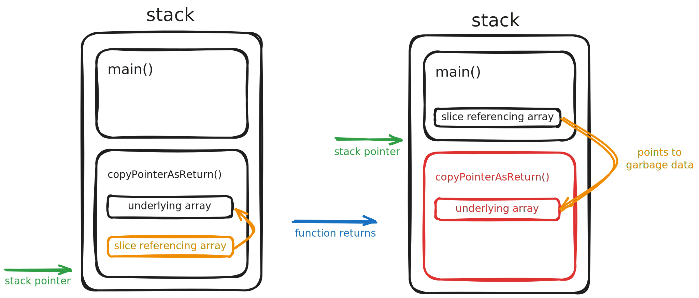
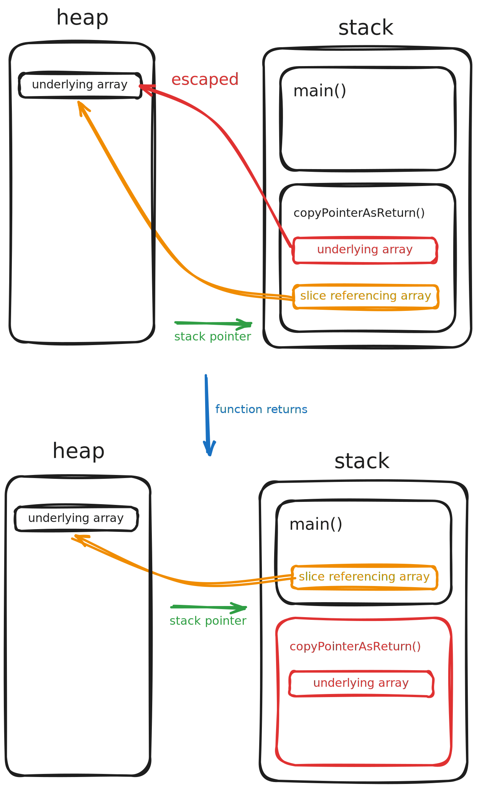

Pointers are handy. They allow us to pass heavy objects around with little computational overhead. However, this assumption sometimes leads developers to design their program's data flow based on pointer types. But this is where things could go wrong.

Let's look at an example of when overusing pointer types to pass data around the program could damage the system's performance. Consider the [copy](https://pkg.go.dev/builtin#copy) function in Go. It takes two arguments: the destination slice and the slice that is being copied into the destination slice. 

```go
func copy(dst, src []Type) int
```

You might wonder why the `copy` function doesn't simply take the source slice and return a copied slice. The reason is that, in Go (as any other garbage collected language), a function returning references to its internal variables would actually slow the program down!

## But why is returning references slow?

In Go, Slices are passed by reference, which means the underlying array is not copied; instead, just a reference to it gets passed around. This, in theory, should make things faster! After all, it's not copying the data, but that's not always the case.

We wrote a copy function that just uses Go's built-in copy function to copy a slice, but we did it in two different ways. In one of them, the destination slice is passed down as an argument, but in the other one, it is created inside the function and returned at the end.

```go
func CopyPointerAsParam(dest []int, src []int) {
	copy(dest, src)
}

func CopyPointerAsReturn(src []int) []int {
	dst := make([]int, len(src))
	copy(dst, src)
	return dst
}
```

We wrote some benchmarks for them as well:

```go
func BenchmarkCopyPointerAsParam(b *testing.B) {
	for i := 0; i < b.N; i++ {
		src := []int{1, 2, 3, 4, 5, 6, 7, 8, 9, 10, 11, 12, 13, 14, 15}
		var dest []int
		CopyPointerAsParam(dest, src)
	}
}

func BenchmarkCopyPointerAsReturn(b *testing.B) {
	for i := 0; i < b.N; i++ {
		src := []int{1, 2, 3, 4, 5, 6, 7, 8, 9, 10, 11, 12, 13, 14, 15}
		_ = CopyPointerAsReturn(src)
	}
}
```

Let's run the benchmarks and see which one is faster:

```sh
$ go test -bench ./...

goos: linux
goarch: amd64
pkg: github.com/alirostami1/escape-analysis-exp/pointer_as_param
cpu: 12th Gen Intel(R) Core(TM) i7-12650H
BenchmarkCopyPointerAsParam-16          423221650                2.817 ns/op
BenchmarkCopyPointerAsReturn-16         43333108                27.54 ns/op
PASS
ok      github.com/alirostami1/escape-analysis-exp/pointer_as_param     2.706s
```

By running the benchmarks, we see that the version with the destination slice being passed down as an argument is ten times faster than the one that returns the destination slice back to the caller function. Odd! Isn't it? 

This is happening because when returning a slice (which is a reference to an underlying array defined inside the function), the compiler is forced to store the array in the heap memory; otherwise, after the function returns and the function stack gets cleaned, the slice would be pointing to a position in the stack that isn't part of the stack anymore. It points to garbage data that could be overwritten by another function at any time!



## Enters Heap

Instead of storing the underlying array in stack memory, the Go compiler detects that it might be referenced outside the function, so it [escapes](https://en.wikipedia.org/wiki/Escape_analysis) the array from the stack memory to the heap memory. This means that any slice referencing the array is still valid even after the function returns. 



We can see this escape from stack memory to heap memory by enabling the `-m` compiler flag which prints out the go compiler's optimization decisions including Escape Analysis:

```sh
$ go test -gcflags="-m" ./... -bench .
...
pointer_as_param/pointer_as_param.go:4:25: dest does not escape
pointer_as_param/pointer_as_param.go:4:37: src does not escape
pointer_as_param/pointer_as_param.go:9:26: src does not escape
pointer_as_param/pointer_as_param.go:10:13: make([]int, len(src)) escapes to heap
...
```

As you can see, while no variable inside the `func CopyPointerAsParam(dest []int, src []int)` escapes, the `make([]int, len(src))` in the `func CopyPointerAsReturn(src []int) []int` escapes to heap.

But why is this slowing the program down? Because heap memory is slow compared to stack memory. With stack, the runtime can just move the stack pointer down to where the function started when it returns, and everything after the pointer will be discarded. However, the heap memory is different; the runtime has to keep track of each object and its references to identify and delete unreachable objects. The garbage collector makes a graph of objects and their references and periodically traverses the graph to identify unreachable nodes, which adds significant complexity and computational overhead.

Passing the slice down to the `copy` function allows the compiler to keep the underlying array inside the main function stack frame, as it will no longer be discarded after the `copy` function returns. As a general rule, pointers and data types that are passed by reference, like maps and slices, should be passed down the call stack, not up.
